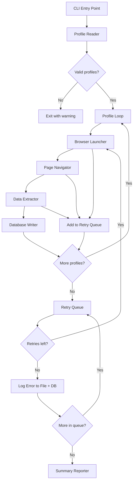
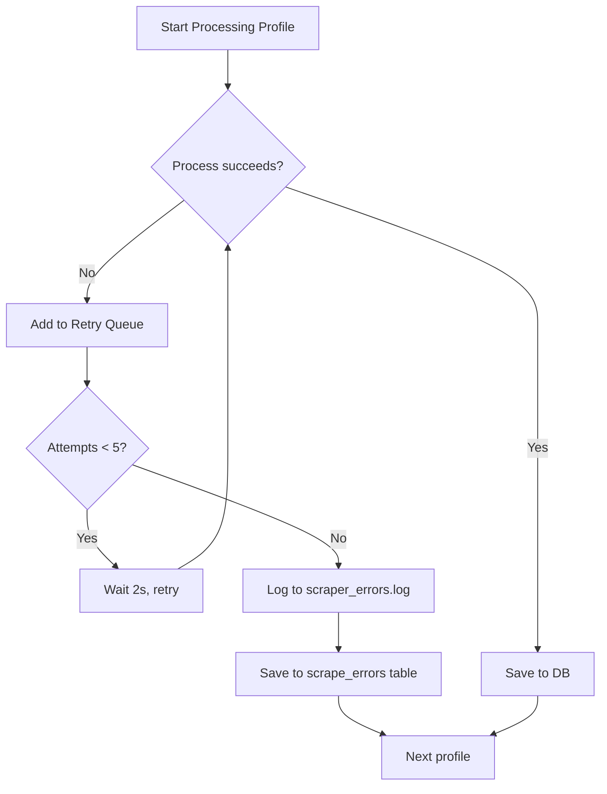

# Design Document: Kiro Account Scraper

## Overview

Kiro Account Scraper là một công cụ dòng lệnh Python tự động hóa việc trích xuất thông tin tài khoản từ trang Account Settings của Kiro.dev. Tool sử dụng Selenium WebDriver để khởi chạy Chrome với các profile đã đăng nhập sẵn, điều hướng đến trang cài đặt tài khoản, trích xuất thông tin (email, user ID, credits, plan, reset date), và lưu kết quả vào cơ sở dữ liệu SQLite.

### Design Decisions

1. **Selenium WebDriver với `--user-data-dir`**: Sử dụng Chrome profile có sẵn thay vì tự động đăng nhập, tránh phức tạp hóa với 2FA/captcha.
2. **SQLite**: Lưu trữ nhẹ, không cần server, phù hợp cho tool chạy local.
3. **Sequential processing**: Xử lý tuần tự từng profile để tránh xung đột Chrome instance và giảm tải hệ thống.
4. **Upsert pattern**: Sử dụng INSERT OR REPLACE để cập nhật record nếu profile đã tồn tại.

## Architecture



### Component Flow

1. **CLI Entry Point** (`main.py`): Điểm khởi đầu, parse arguments (num_profiles), orchestrate workflow
2. **Browser Launcher** (`browser.py`): Khởi tạo Chrome WebDriver với profile local
3. **Page Navigator** (`navigator.py`): Điều hướng và chờ trang load
4. **Data Extractor** (`extractor.py`): Trích xuất thông tin từ DOM
5. **Database Writer** (`database.py`): Quản lý SQLite operations
6. **Summary Reporter** (`reporter.py`): Hiển thị kết quả tổng hợp
7. **Web Dashboard** (`dashboard/`): Static HTML dashboard với chart credits history

## Components and Interfaces

### 1. Browser Launcher (`browser.py`)

```python
from selenium import webdriver
from selenium.webdriver.chrome.options import Options

class BrowserLauncher:
    def __init__(self, profile_path: str):
        """Initialize with Chrome profile directory path."""
        
    def launch(self) -> webdriver.Chrome:
        """
        Launch Chrome with the specified user-data-dir.
        Returns WebDriver instance.
        Raises ProfileNotFoundError if profile directory doesn't exist.
        """
        
    def close(self, driver: webdriver.Chrome) -> None:
        """Close browser and release resources."""
```

### 3. Page Navigator (`navigator.py`)

```python
from selenium import webdriver

ACCOUNT_SETTINGS_URL = "https://app.kiro.dev/settings/account"
PAGE_LOAD_TIMEOUT = 30  # seconds

class PageNavigator:
    def __init__(self, driver: webdriver.Chrome):
        """Initialize with active WebDriver instance."""
        
    def navigate_to_settings(self) -> bool:
        """
        Navigate to Account Settings page and wait for content.
        Returns True if page loaded successfully.
        Raises TimeoutError if page doesn't load within timeout.
        """
```

### 4. Data Extractor (`extractor.py`)

```python
from dataclasses import dataclass
from typing import Optional

@dataclass
class AccountInfo:
    email: Optional[str]
    user_id: Optional[str]
    credits_used: Optional[int]
    credits_total: Optional[int]
    plan_name: Optional[str]
    reset_date: Optional[str]

class DataExtractor:
    # DOM Selectors
    EMAIL_SELECTOR = 'p[data-variant="semibold"][data-size="sm"]'
    USER_ID_META = 'meta[name="user-id"]'
    CREDITS_SELECTOR = 'p[aria-label*="credits used out of"]'
    PLAN_SELECTOR = '.acme-Badge-label'
    
    def __init__(self, driver: webdriver.Chrome):
        """Initialize with active WebDriver instance."""
        
    def extract_all(self) -> AccountInfo:
        """
        Extract all account information from the current page.
        Returns AccountInfo with None for any fields that couldn't be found.
        """
        
    def extract_email(self) -> Optional[str]:
        """Extract email from p[data-variant='semibold'][data-size='sm']."""
        
    def extract_user_id(self) -> Optional[str]:
        """Extract user ID from meta[name='user-id'] content attribute."""
        
    def extract_credits(self) -> tuple[Optional[int], Optional[int]]:
        """
        Extract credits used and total from aria-label.
        Parses 'X credits used out of Y' pattern.
        """
        
    def extract_plan_name(self) -> Optional[str]:
        """Extract plan name from .acme-Badge-label element."""
        
    def extract_reset_date(self) -> Optional[str]:
        """Extract reset date from text containing 'resets on'."""
```

### 5. Database Writer (`database.py`)

```python
import sqlite3
from datetime import datetime

class DatabaseWriter:
    def __init__(self, db_path: str = "dashboard/kiro_accounts.db"):
        """Initialize and create tables (accounts + credits_history + scrape_errors) if not exists."""
        
    def save_account(self, profile_name: str, info: AccountInfo) -> None:
        """
        Insert or update account record in accounts table.
        Also insert a new record into credits_history for tracking over time.
        """
        
    def save_error(self, profile_name: str, error_message: str, attempts: int) -> None:
        """Save a persistent scraping error to the scrape_errors table."""
        
    def get_history(self, profile_name: str) -> list[dict]:
        """Get credits history for a specific profile, ordered by time."""
        
    def close(self) -> None:
        """Close database connection."""
```

### 6. Summary Reporter (`reporter.py`)

```python
@dataclass
class ScrapingResult:
    profile: str
    success: bool
    error: Optional[str] = None

class SummaryReporter:
    def __init__(self):
        self.results: list[ScrapingResult] = []
        
    def add_result(self, result: ScrapingResult) -> None:
        """Record a scraping result."""
        
    def print_progress(self, current: int, total: int, profile: str) -> None:
        """Print current progress."""
        
    def print_summary(self) -> None:
        """Print final summary with totals."""
```

### 7. Web Dashboard (`dashboard/index.html`)

**Static HTML file** — không cần Python server, mở qua bất kỳ static file server nào.

**Tech stack:**
- HTML + vanilla JS + Chart.js (CDN)
- sql.js (SQLite compiled to WASM) để đọc file `.db` trực tiếp từ browser
- DB file được fetch từ public path (cùng thư mục với dashboard.html)

**Layout:**
- Left panel: Accounts table (username, plan, credits used/total, remaining, daily usage, last extracted)
- Right panel: Chart.js line chart
- Default view: Tổng credits remaining & total across all accounts
- Click account → chart riêng của account đó
- Time range selector: 1 tuần, 1 tháng, 3 tháng (default), 6 tháng, 1 năm
- Detailed toggle: all records per day vs last record only
- Grid layout: 3fr (table) / 4fr (chart) để đủ chỗ cho nhiều cột
- Responsive breakpoint: 1100px chuyển sang single column

```javascript
// Pseudo-code flow
// 1. Page loads → fetch('kiro_accounts.db') from same directory
// 2. sql.js opens the database in memory
// 3. Query scrape_errors table → render warning banner if errors exist
// 4. Query accounts table → render left panel
// 5. Calculate daily usage per profile:
//    - Query today's latest credits_used per profile from credits_history
//    - Query previous day's last credits_used per profile
//    - Daily usage = today's credits_used - previous day's credits_used
//    - Handle credit resets (negative delta → use today's credits_used)
// 6. Query credits_history → render chart
// 7. Click account → filter chart by profile_name
// 8. Time range / detailed toggle → re-query and re-render chart
```

## Data Models

### SQLite Schema

```sql
-- Bảng chính: thông tin mới nhất của mỗi account (upsert)
CREATE TABLE IF NOT EXISTS accounts (
    profile_name TEXT PRIMARY KEY,
    email TEXT,
    user_id TEXT,
    credits_used REAL,
    credits_total REAL,
    plan_name TEXT,
    reset_date TEXT,
    extracted_at TEXT NOT NULL
);

-- Bảng lịch sử: mỗi lần scrape thêm 1 record mới để theo dõi credits theo thời gian
CREATE TABLE IF NOT EXISTS credits_history (
    id INTEGER PRIMARY KEY AUTOINCREMENT,
    profile_name TEXT NOT NULL,
    credits_used REAL,
    credits_total REAL,
    plan_name TEXT,
    extracted_at TEXT NOT NULL,
    FOREIGN KEY (profile_name) REFERENCES accounts(profile_name)
);

-- Bảng lỗi: lưu các profile fail sau khi retry hết số lần cho phép
CREATE TABLE IF NOT EXISTS scrape_errors (
    id INTEGER PRIMARY KEY AUTOINCREMENT,
    profile_name TEXT NOT NULL,
    error_message TEXT,
    attempts INTEGER,
    failed_at TEXT NOT NULL
);
```

### AccountInfo Dataclass

| Field | Type | Source | Nullable |
|-------|------|--------|----------|
| email | str | `p[data-variant="semibold"][data-size="sm"]` | Yes |
| user_id | str | `meta[name="user-id"]` content attribute | Yes |
| credits_used | int | Parsed from aria-label | Yes |
| credits_total | int | Parsed from aria-label | Yes |
| plan_name | str | `.acme-Badge-label` text | Yes |
| reset_date | str | Text near "Estimated Usage" with "resets on" | Yes |

## Correctness Properties

*A property is a characteristic or behavior that should hold true across all valid executions of a system—essentially, a formal statement about what the system should do. Properties serve as the bridge between human-readable specifications and machine-verifiable correctness guarantees.*

### Property 1: Profile filtering preserves only valid entries

*For any* text file content consisting of arbitrary lines (empty lines, lines starting with "#", and non-empty/non-comment lines), the profile reader SHALL return exactly the lines that are non-empty and do not start with "#", in their original order.

**Validates: Requirements 1.1, 1.2**

### Property 2: Credits parsing round-trip

*For any* pair of non-negative integers (used, total), formatting them as "{used} credits used out of {total}" and then parsing with the credits extractor SHALL return the original (used, total) pair.

**Validates: Requirements 4.3**

### Property 3: Reset date extraction

*For any* date string in the expected format, embedding it in text as "resets on {date}" and parsing with the reset date extractor SHALL return the original date string.

**Validates: Requirements 4.5**

### Property 4: DOM field extraction correctness

*For any* valid HTML document containing elements matching the expected selectors (`p[data-variant="semibold"][data-size="sm"]`, `meta[name="user-id"]`, `.acme-Badge-label`) with arbitrary text content, the extractor SHALL return the exact text content of those elements.

**Validates: Requirements 4.1, 4.2, 4.4**

### Property 5: Missing fields yield None

*For any* subset of expected DOM selectors that are absent from an HTML document, the corresponding fields in the extracted AccountInfo SHALL be None, while present fields are correctly extracted.

**Validates: Requirements 4.6**

### Property 6: Database upsert round-trip

*For any* sequence of AccountInfo records saved under the same profile name, reading back from the database SHALL always return the most recently saved record with all fields matching, and exactly one record SHALL exist for that profile.

**Validates: Requirements 5.2, 5.4**

### Property 7: Summary counts accuracy

*For any* list of ScrapingResult objects (mix of successes and failures), the summary reporter SHALL report totals where: total = len(results), successes = count where success=True, failures = count where success=False, and total = successes + failures.

**Validates: Requirements 6.2**

## Error Handling

### Retry Queue

Failed profiles are added to a retry queue and re-attempted up to 5 times with a 2-second delay between retries. If all retries are exhausted:
- Error is logged to `scraper_errors.log` (append mode)
- Error is saved to `scrape_errors` table in the database
- Dashboard displays a warning banner with recent errors

### Error Categories

| Error | Source | Handling | Recovery |
|-------|--------|----------|----------|
| File not found | Profile Reader | Log error with file path, exit with code 1 | None - fatal |
| No valid profiles | Profile Reader | Log warning, exit with code 0 | None - graceful exit |
| Profile dir not found | Browser Launcher | Add to retry queue | Retry up to 5 times |
| Browser launch failure | Selenium | Add to retry queue | Retry up to 5 times |
| Page timeout (30s) | Page Navigator | Add to retry queue | Retry up to 5 times |
| Element not found | Data Extractor | Log warning per field, set to None | Continue extraction of other fields |
| Database error | Database Writer | Log error, raise | Fatal - cannot continue |

### Error Flow



### Logging Strategy

- Use Python's `logging` module with configurable level
- Default level: INFO
- Format: `[%(asctime)s] %(levelname)s - %(message)s`
- Errors include profile name for traceability

## Testing Strategy

### Property-Based Tests (using Hypothesis)

Property-based testing is appropriate for this feature because:
- Profile parsing has clear input/output behavior with a large input space
- Credits/date parsing are pure functions with universal properties
- Database operations have round-trip properties
- Summary calculation is a pure function

**Configuration:**
- Library: [Hypothesis](https://hypothesis.readthedocs.io/)
- Minimum iterations: 100 per property
- Each test tagged with: `Feature: kiro-account-scraper, Property {N}: {description}`

**Properties to implement:**
1. Profile filtering (Property 1)
2. Credits parsing round-trip (Property 2)
3. Reset date extraction (Property 3)
4. DOM field extraction (Property 4)
5. Missing fields yield None (Property 5)
6. Database upsert round-trip (Property 6)
7. Summary counts accuracy (Property 7)

### Unit Tests (using pytest)

- **Profile Reader**: File not found error, empty file warning, specific format examples
- **Browser Launcher**: Verify `--user-data-dir` option is set correctly, non-existent profile handling
- **Page Navigator**: Timeout handling (mocked), URL correctness
- **Data Extractor**: Specific HTML examples with known values
- **Database Writer**: Schema creation verification, timestamp format
- **Summary Reporter**: Progress output format, specific summary examples

### Integration Tests

- End-to-end test with a mock HTML page served locally
- Full pipeline: read profiles → launch browser → extract → save → verify DB content
- Requires Chrome/ChromeDriver installed

### Test Organization

```
tests/
├── test_profile_reader.py      # Unit + Property tests for profile parsing
├── test_extractor.py           # Unit + Property tests for data extraction
├── test_credits_parser.py      # Property tests for credits parsing
├── test_database.py            # Unit + Property tests for DB operations
├── test_reporter.py            # Unit + Property tests for summary
└── test_integration.py         # Integration tests (optional, requires Chrome)
```

